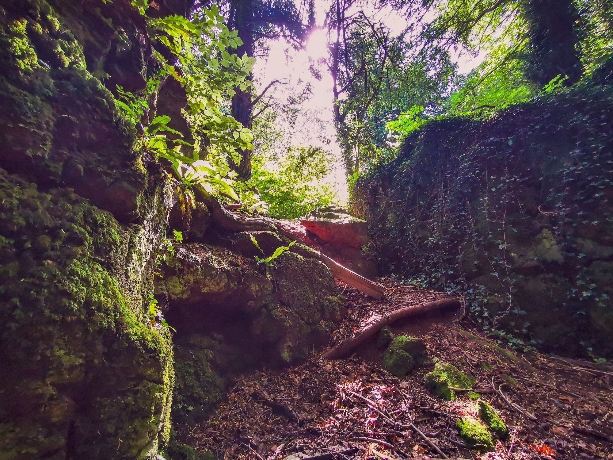
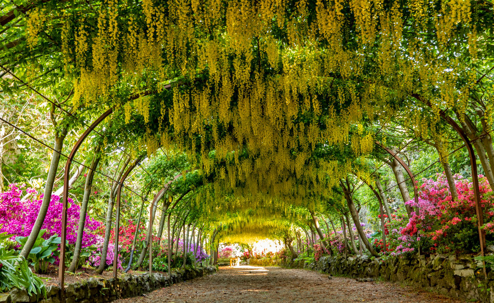

# SECRET WORLDS: 2 MYSTERIOUS BRITISH GARDENS

It is hard to believe, but the beauty of the mysterious garden creators of the picture did not draw with the help of computer graphics - the living scenery for the film were really existing British gardens, which can be visited by anyone. The border with Great Britain is already open for tourists from Russia. 

## Puzzlewood Forest Park in the forest of Deena (Gloucestershire county, England).

It is believed that Puzzlewood was the prototype of Middle-earth from "Lord of the Rings", "Hobbit", "Silmarillion" and "Unfinished Stories" by John Ronald Ruel Tolkin. At least, Tolkin liked to spend his free time here. Not far from these places was Joanne Rowling, who created the literary world of Harry Potter: for example, Puzzlewood was a prototype for the Forbidden Forest, located next to the Hogwarts School of Witchcraft and Magic. And the film "Harry Potter and the Deathly Gifts: Part I" was filmed here.

The Puzzlewood Chalices also served as sets for the films Star Wars: Awakening Power, Jack the Conqueror of Giants, Snow White and Hunter 2, Midsummer Night's Dream, Merlin, Doctor Who, Da Vinci's Demons, Dark Crystal: The Age of Resistance, and others.

Puzzlewood - part of the Dean Forest, the oldest in England. Dean was declared a royal forest a thousand years ago, during the reign of William the Conqueror. Before that, the Romans settled nearby were mining iron ore in the forest, and the trees were converted to charcoal. Then the Romans were driven out, but ore mining did not stop, and the trees were used to build ships of the Royal Navy. When the mining was covered, nature began to return the lost beauty. Numerous labyrinth mines left in Dina after ore mining gradually overgrown with moss, lichen, grass, bushes and trees. As a result, the place has turned into a fairytale forest, walking along which you will face an elf or a dwarf nose to nose. Or a fairy of some kind, at the worst.

## Bodnant Garden (North Wales)

This garden, located in the valley of the picturesque Welsh river Conway, is considered one of the most beautiful in all of Wales. And in translation from Welsh its name means "house by the creek".

The first estate in the garden appeared in the middle of the XVIII century. However, the date of birth of the park is considered 1875, when the famous landscape architect Edward Milner began to create an ordinary Victorian garden by order of the estate owner, an English industrialist Henry Davis Pochin.

Pochina Pochina his descendants continued, adding new plants to the garden. As a result, today Bodnant Garden is a collection of plants from all over the world, capable of surviving in the Welsh climate. The pride of Bodnant became a giant sequoia, which in the early XX century brought here from Oregon.

The garden is unusually beautiful at any time of year, but it looks especially impressive in spring, when the famous 55-meter arch, twisted by a yellow laburnum, blooms, which will be seen by the audience of the "Mysterious Garden".
